# Two-way audio: setting up HTTPS on each device

Talking back through the doorbell card needs the browser to treat the page as secure. This is a
step-by-step, per-device guide with screenshots. For the full reference — what our cloud sees,
where the keys live, routers, installation types and troubleshooting — see
**[docs/https.md](https.md)**.

- [Do you even need this page?](#do-you-even-need-this-page)
- [The install page, and the two ways in](#the-install-page-and-the-two-ways-in)
- [iPhone and iPad](#iphone-and-ipad)
- [Android](#android)
- [Windows (Chrome / Edge)](#windows-chrome--edge)
- [macOS (Safari / Chrome)](#macos-safari--chrome)
- [Wall tablets and kiosk screens](#wall-tablets-and-kiosk-screens)
- [Confirming it worked](#confirming-it-worked)
- [Troubleshooting](#troubleshooting)

## Do you even need this page?

If you already open Home Assistant over HTTPS — Home Assistant Cloud (Nabu Casa), or your own
domain behind a reverse proxy — no. The microphone already works there; nothing below applies.

This page is for everyone else: Home Assistant opened at home as `http://homeassistant.local:8123`
or `http://192.168.1.10:8123`, on a phone, a computer or a wall tablet. Tapping the microphone on
one of those pages shows the card's own notice instead of silently failing:

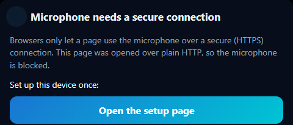

*Tap **Open the setup page** (or scan the QR code shown on a desktop screen) to land on the page
this guide walks through.*

## The install page, and the two ways in

Every step below starts at the same place, opened on the device you are setting up:

```
http://<your-home-assistant-address>:8123/ig_doorbell/https
```

(Reached from **Configure → Secure local connection (HTTPS)**, from the card's own notice above,
or from a QR code on a bigger screen.) It detects the device and shows only the steps that
device needs. It always offers two ways in:

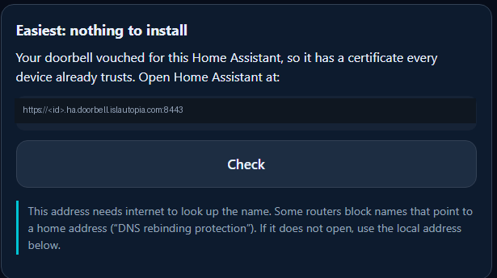

- **A public name** (`https://<id>.ha.doorbell.islautopia.com:8443`) — a certificate every phone,
  tablet and computer already trusts, **nothing to install**. It only appears if an IG Doorbell in
  your installation is paired here as administrator and registered with the Islautopia cloud (it
  vouches for your Home Assistant). It needs internet to resolve the name; some routers block
  names that point to a home address ("DNS rebinding protection") — if it does not open, use the
  local address below.
- **The local address** (`https://<ip>:8443` or `https://homeassistant.local:8443`) — works with
  no internet and no doorbell at all. Its certificate comes from the integration's own local
  certificate authority: install that authority's **root** once on each device (steps below per
  platform), then the address just works from then on.

Whichever way you got in, the page ends with a **Check** button: press it and it says *Ready* or
tells you exactly what is still missing.

## iPhone and iPad

If the public name works for you, open it in Safari and you are done — skip to confirming the
microphone below. Otherwise, install the local root once. Screenshots below are from a real
iPhone; an iPad walks through the same screens.

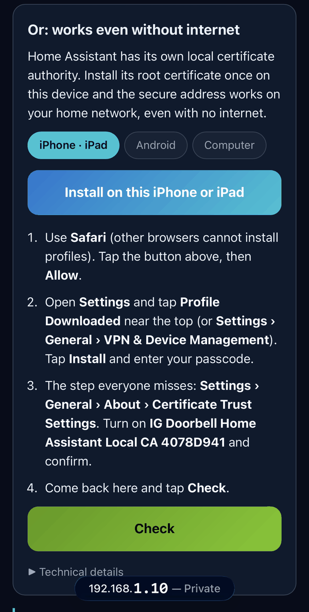

*Open the install page in **Safari** (other browsers cannot install profiles) and tap **Install on
this iPhone or iPad**.*

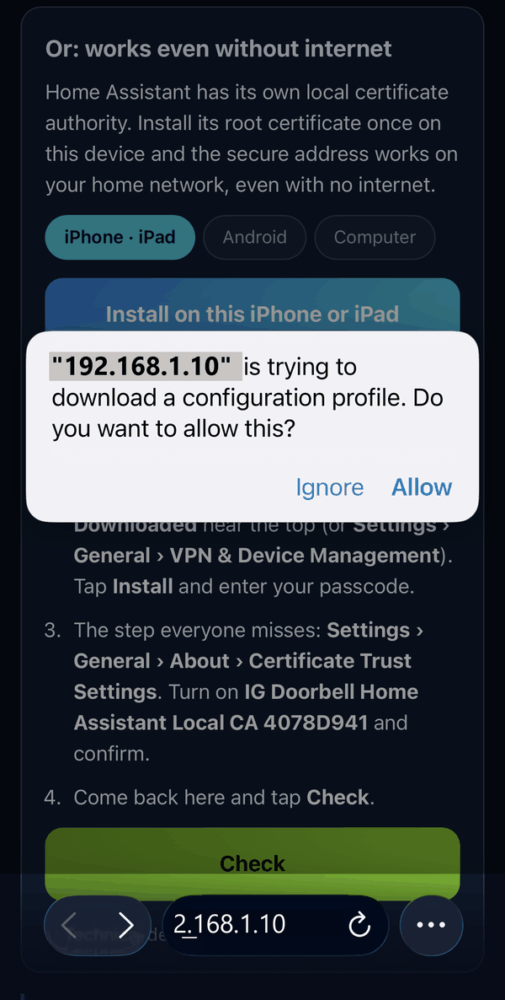

*Tap **Allow**.*

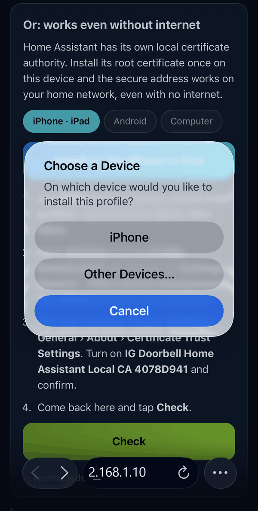

*This dialog only appears if you have an **Apple Watch paired** to the phone — choose **iPhone**.
Without a paired watch, iOS skips straight to Settings.*


*Open **Settings** and tap **Profile Downloaded** near the top (or **Settings → General → VPN &
Device Management** if it has scrolled off).*

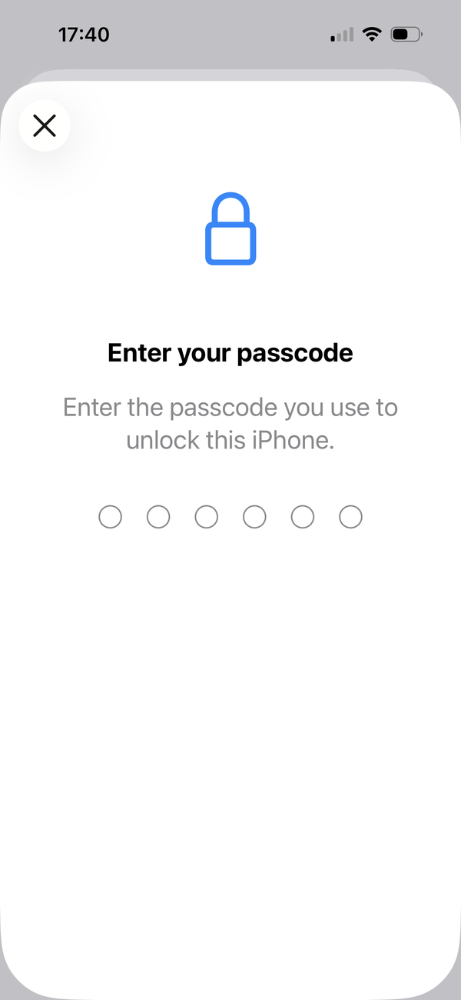

*Enter the passcode you use to unlock the device.*

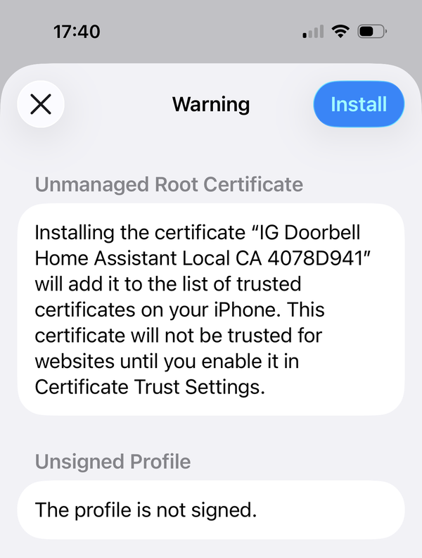

*A generic iOS warning shown for **any** self-installed root, not something specific to this
integration. Tap **Install**.*

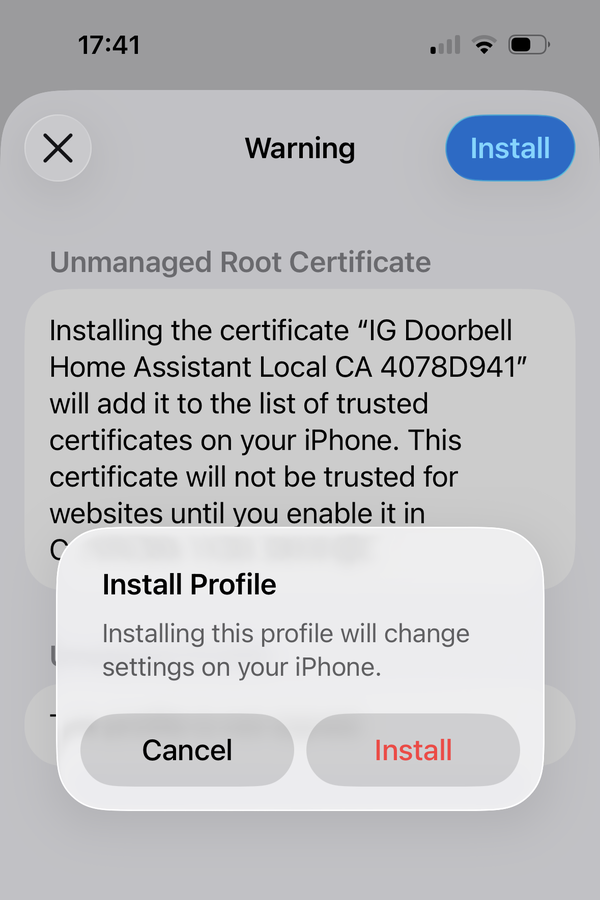

*Confirm on the follow-up dialog.*

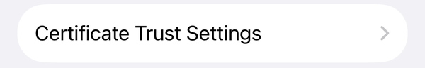

*The step almost everyone misses: installing the profile is not enough by itself. **Settings →
General → About → Certificate Trust Settings** has a separate switch for the new root.*

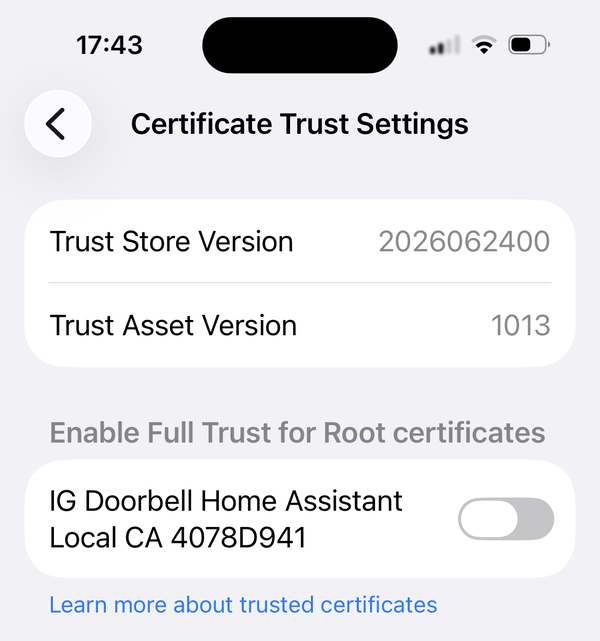

*The certificate is listed but its switch is off — turn it on.*

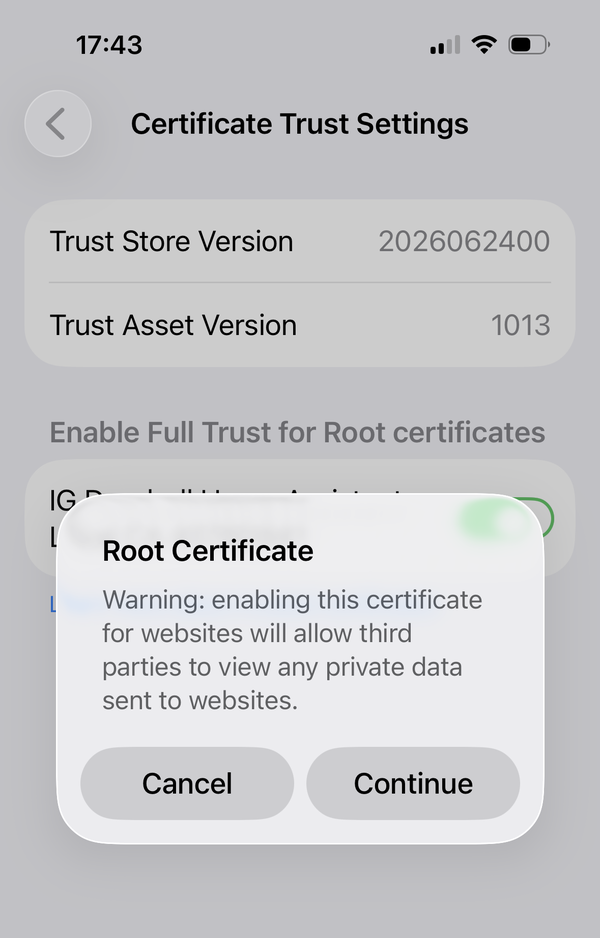

*iOS warns that a trusted root **could** intercept traffic to any website — the generic warning it
shows for every root, worded for the worst case it has to guard against. This one cannot: the IG
Doorbell root carries **name constraints** (private IP ranges, `.local`, and this integration's
own public name only), so devices that trust it still refuse a certificate it signs for any other
site — measured directly: a certificate for `www.example.com` signed with the real root key is
rejected. Tap **Continue**.*

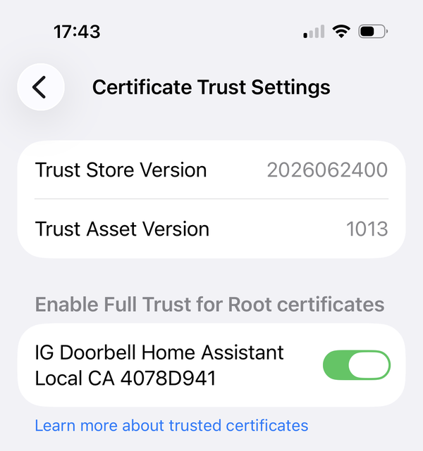

*Trust is now on.*

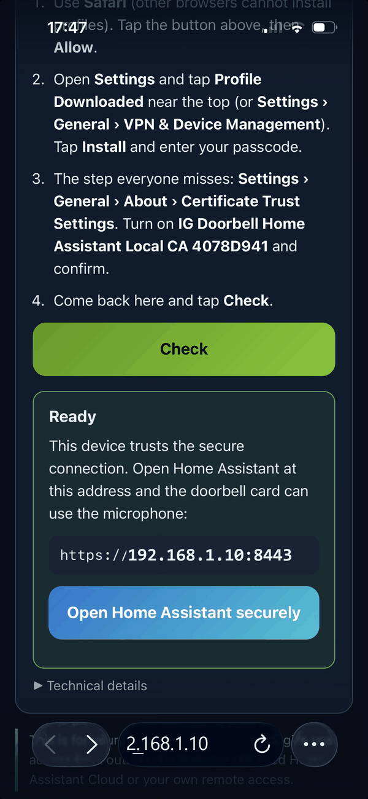

*Come back to the install page and tap **Check**. It confirms the address and offers to open Home
Assistant securely.*

**Home Assistant Companion app.** Set its server address to the secure one too, so calls placed
from the app also get the microphone: in the app, **Settings → Companion app → (your server) →
Internal URL**.

## Android

Same idea, Android's own certificate store instead of iOS's profile:

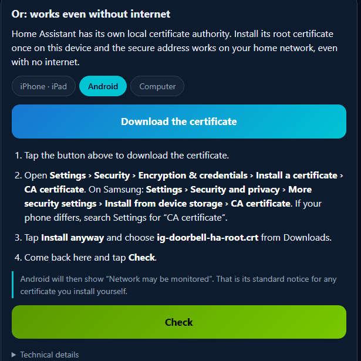

Android shows a **"Network may be monitored"** notice after installing any certificate yourself —
that is its standard, generic warning for a user-installed CA, not something specific to this
integration. It is expected; press through it and continue to **Check**.

**Home Assistant Companion app.** Same setting as iOS, under **Settings → Companion app → your
server → Internal URL**.

## Windows (Chrome / Edge)

Both browsers use the Windows certificate store, so one install covers them both:

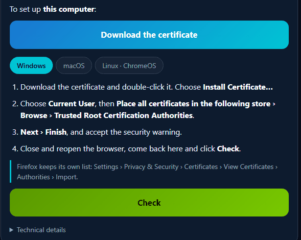

After step 4 (closing and reopening the browser), the **same steps and the same install page**
work identically in Edge — Windows keeps one trusted-root store for every Chromium-based browser,
so there is nothing Edge-specific to add. Firefox is the one exception on any desktop: it keeps
its own certificate list rather than using the OS store (**Settings → Privacy & Security →
Certificates → View Certificates → Authorities → Import**).

## macOS (Safari / Chrome)

Safari and Chrome on a Mac both use the system Keychain, so this also covers both in one pass:

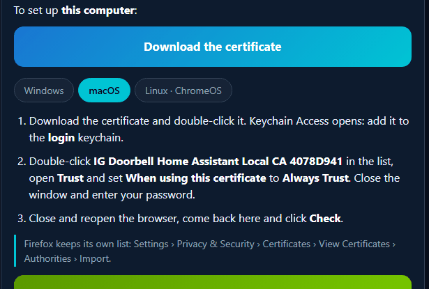

The trust setting is the part that is easy to miss here too: double-clicking the certificate in
Keychain Access only *adds* it — you still have to open **Trust** inside it and set **When using
this certificate** to **Always Trust** before macOS actually honours it.

## Wall tablets and kiosk screens

A wall tablet running the Home Assistant Companion app in kiosk mode is, for this purpose, just
another Android or iPad device: install the root the same way (Android or iPhone/iPad section
above, whichever the tablet runs), then point the companion app's Internal URL at the secure
address as described there. Nothing about kiosk mode changes the certificate story.

## Confirming it worked

Back on the install page, **Check** should say *Ready*. Then open the doorbell card and tap the
microphone. The first time, the browser (or the Companion app) asks for microphone access:

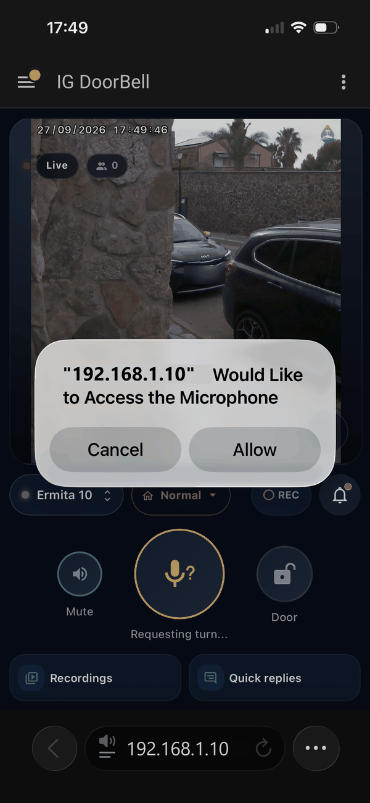

*Tap **Allow**. Video, sound and the rest of the card work the same whether HTTPS is on or off —
this permission prompt is the only thing that changes.*

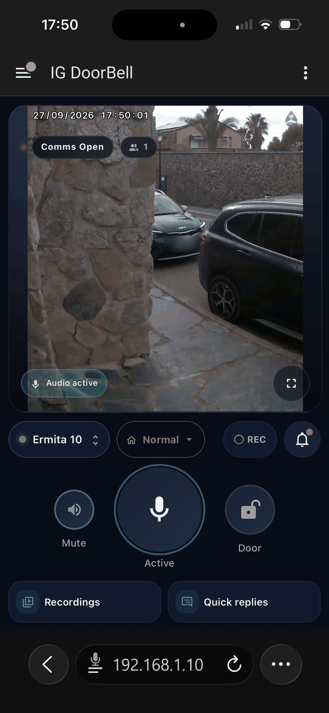

*Once allowed, the mic button turns solid and the card shows **Audio active** — talking back now
works.*

## Troubleshooting

**The public name does not open, the local address does.** Your router or DNS filter blocks
names that resolve to a private address (see *DNS rebinding protection* above), or the device has
no internet right now. Use the local address instead — it never needs to look anything up beyond
your own network.

**"Not ready yet" after installing the certificate.** Almost always the trust step, not the
install step: on iPhone/iPad, the Certificate Trust Settings switch; on Android, check the
certificate was installed as a **CA certificate**, not as a Wi-Fi or VPN certificate; on a
computer, restart the browser (Firefox keeps its own separate list — see above).

**A certificate warning in the browser.** The root is not installed or not trusted yet on that
specific device/browser — installing it once fixes every address on your home network from then
on, it is not a per-visit step.

More detail on every one of these, plus what our cloud does and does not see and how the local
certificate authority's key is kept: **[docs/https.md](https.md)**.
